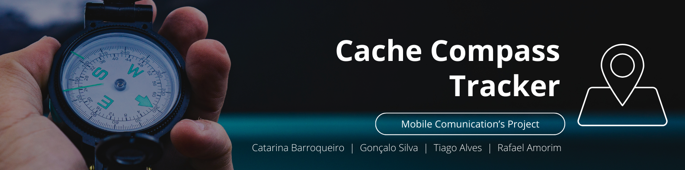
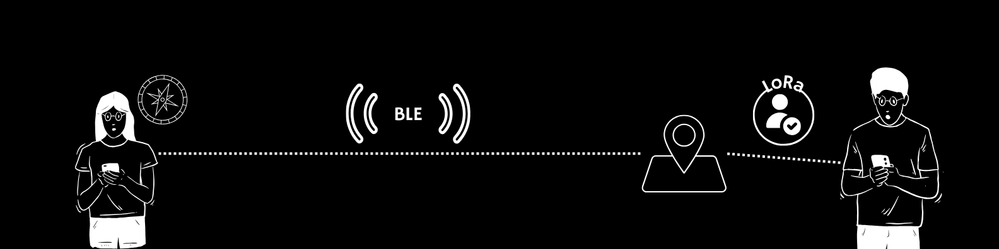

## Introduction

The Cache Compass Tracker project, developed as a proof of concept for the Mobile Communications subject, is an innovative geocaching solution that combines Bluetooth Low Energy (BLE) technology and Long Range (LoRa) communication. This project aims to demonstrate the potential of leveraging these technologies to enhance the geocaching experience. Geocaching enthusiasts participating in this proof of concept can utilize their smartphones not only to locate hidden caches but also to receive directional guidance and authentication through BLE and LoRa technologies.

## Overview
### Bluetooth Low Energy (BLE) Integration

Bluetooth Low Energy (BLE) is a wireless communication technology designed for short-range communication with low power consumption. In the Cache Compass Tracker project, BLE serves as a crucial component to establish a seamless connection between the user's smartphone and the hidden geocache.

#### Connection Establishment

The BLE module integrated into the Cache Compass Tracker acts as a beacon embedded within the cache. When a user approaches the location of a hidden cache, the BLE module initiates communication with the user's smartphone. Unlike traditional Bluetooth, BLE is optimized for energy efficiency, making it well-suited for battery-powered devices like smartphones.

#### Proximity Detection

As the BLE module communicates with the user's phone, it provides real-time information about the cache's proximity. This real-time feedback allows geocaching enthusiasts to receive immediate updates as they get closer to the hidden cache.

#### Energy Efficiency

One of the key advantages of BLE is its energy-efficient design. The low power consumption of BLE allows for extended battery life, making it an ideal choice for applications where minimizing energy usage is crucial, such as in mobile devices like smartphones.

In summary, the Cache Compass Tracker's BLE integration establishes an energy-efficient and real-time communication link between the geocache beacon and the user's smartphone. This technology not only enables proximity detection but also enhances the overall geocaching adventure by providing directional guidance, showcasing the versatility and efficiency of BLE in recreational applications.

#### Initiating LoRa Communication

When a user is in the immediate vicinity of the cache and intends to claim it, the LoRa communication is initiated. This process ensures that the user's identity is confirmed through a long-range connection, preventing unauthorized individuals from making accidental or false claims.

## Features

1. **Real-time Directional Guidance:** The system guides users towards the cache location by providing clear directional cues through the BLE connection, making the geocaching experience more interactive and user-friendly.

2. **Authentication via LoRa:** Users must authenticate themselves using LoRa technology when in close proximity to the cache. This ensures that only the rightful discoverer can claim the find, enhancing the integrity of the geocaching activity.

3. **Smartphone Compatibility:** Cache Compass Tracker is designed to work seamlessly with smartphones, leveraging their capabilities to deliver an intuitive and accessible geocaching experience.

## How It Works

1. **Initialization:** Users start the Cache Compass Tracker app on their smartphones, initiating the BLE connection.

2. **Proximity Detection:** As users approach the cache location, the BLE module communicates with the smartphone, providing real-time proximity information and directional guidance.

3. **LoRa Authentication:** Upon reaching the immediate vicinity of the cache, the LoRa authentication process is triggered, confirming the user's identity.

4. **Claiming the Cache:** Once authenticated, users can confidently claim the cache as their discovery, enhancing the overall geocaching adventure.

