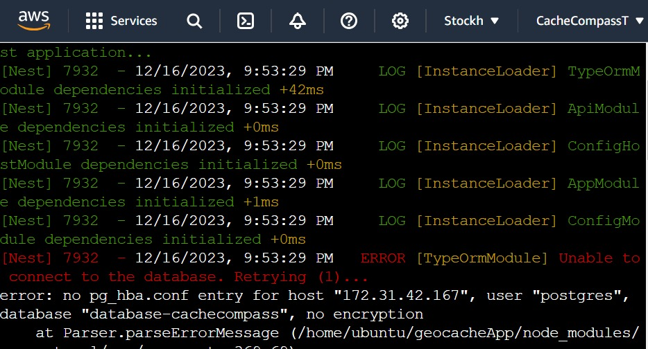
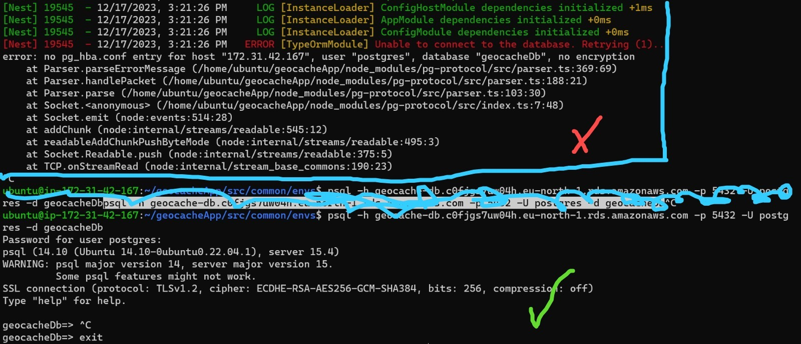
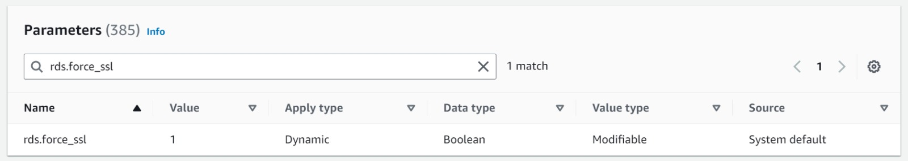
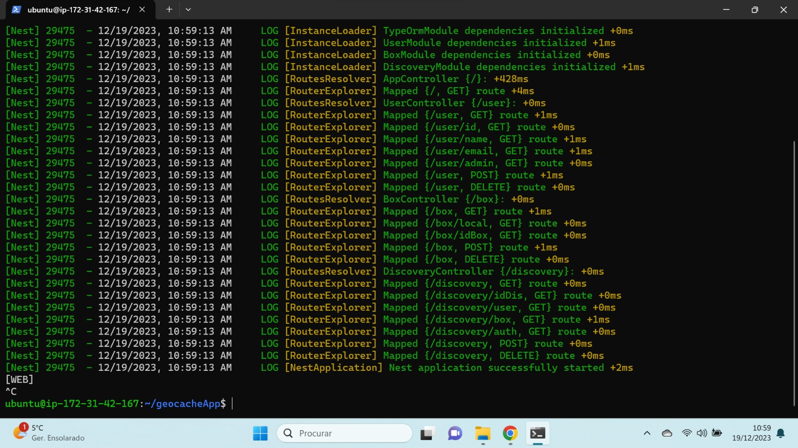

# Desenvolvimento de uma WebApp

## Desenvolvimento do Backend

No início do projeto, iniciei o desenvolvimento de uma base de dados local no PostgreSQL. Esta base foi concebida para armazenar dados de utilizadores (tabela User), caches existentes (tabela Box) e descobertas realizadas (tabela Discovery). Posteriormente, implementei um backend utilizando NestJS e TypeORM, no qual cada tabela possui APIs para operações Get, Delete e Post, permitindo também pesquisas filtradas por diferentes atributos. Após a correta implementação do backend localmente, segui um tutorial [aqui](https://betterprogramming.pub/nest-js-project-with-typeorm-and-postgres-ce6b5afac3be) para desenvolver o frontend.

## Desenvolvimento do Frontend

Para proporcionar ao administrador uma interface em tempo real das descobertas dos utilizadores, criei um projeto Angular seguindo o tutorial [aqui](https://angular.io/tutorial/tour-of-heroes/toh-pt0). O frontend inclui três páginas (login, sign up e History), restritas ao login de contas administrativas. A interface foi projetada para fornecer uma visão global das atividades dos utilizadores.

## Integração Frontend e Backend

Ao usar a biblioteca HttpClient no projeto Angular, vinculei o frontend ao backend. Implementei corretamente as APIs para verificar login, adicionar novos utilizadores (SignUp) e obter dados em tempo real para a página de histórico. No entanto, ao executar o projeto em vários navegadores, enfrentamos o erro 'Access to XMLHttpRequest has been blocked by CORS policy: No ‘Access-Control-Allow-Origin’ header present.' Para contornar esse problema, pesquisamos soluções [aqui](https://www.bannerbear.com/blog/what-is-a-cors-error-and-how-to-fix-it-3-ways/) e adicionamos as configurações de CORS no ficheiro main.ts do backend.

```typescript
const CORS_OPTIONS = {
  origin: true,
  allowedHeaders: [
    'Origin',
    'X-Requested-With',
    'Accept',
    'Content-Type',
    'Authorization'
  ],
  methods: ['GET', 'PUT', 'OPTIONS', 'POST', 'DELETE'],
};

async function bootstrap() {
  const app = await NestFactory.create(AppModule);

  app.enableCors(CORS_OPTIONS);

  app.useGlobalPipes(new ValidationPipe({ whitelist: true, transform: true }));

  await app.listen(3000, '0.0.0.0', () => {
    console.log('[WEB]');
  });
}

bootstrap();
```
Essa adição no ficheiro main.ts permitiu o acesso correto do frontend ao backend, solucionando o problema de CORS e assegurando a visualização adequada dos dados na interface desenvolvida.

### Deploy na AWS

Para permitir a interação da aplicação Android com a mesma base de dados e verificar os utilizadores, realizamos o deploy do backend na AWS, seguindo [este tutorial](https://ututuv.medium.com/deploying-nestjs-api-on-aws-ec2-rds-using-ubuntu-server-and-pm2-82f9bb8d996). Inicialmente, criamos uma base de dados PostgreSQL no Amazon RDS e, em seguida, atualizamos o ficheiro development.env do backend com os dados da nova base de dados. Clonei o repositório com o código relativo ao Backend mais recente na instância AWS EC2, e ao correr este mesmo código que localmente corria corretamente obtive o seguinte erro: 



Tendo em conta que me encontrava a trabalhar num AWS EC2 que tentava ligar a um AWS RDS, ficheiros como o pg_hba.conf não são disponibilizados, pelo que o conteúdo destes ficheiros corrresponde a múltiplas configurações disponíveis na definição da instancia AWS RDS. Após múltiplas pesquisas concluí que este erro é comum localmente e se resolve através da alteração do ficheiro pg_hba.conf, tendo em conta que o mesmo não é disponibilizado tentei então alterar os Security Groups da base de dados que definem o range de ips, ou os ips especificos que podem ou não aceder à instancia RDS. No entanto, quando utilizava o EC2 me conectar à RDS, esta permitia o acesso, no entanto quando corria o Backend esta bloqueava exatamente o mesmo ip, pelo que o erro não seria relativo ás permissoes de Security Groups: 



Tentei tambem desligar a encriptação da base de dados, entre outras configurações que também não permitiram o acesso do EC2 á instancia RDS. Tendo em conta que o erro indica algo relativo á encriptação, ao observar atentamente as configurações default de uma instancia Postgres RDS na sua versão 15.2, verifiquei que o parametrords.force_ssl se encontrava a 1.



A alteração do parâmetro rds.force_ssl de 1 para 0 foi necessária para permitir a comunicação adequada entre a instância do Amazon EC2 e a base de dados PostgreSQL hospedada no Amazon RDS. Ao configurar o rds.force_ssl como 0, desativamos a exigência de conexões seguras via SSL. Essa mudança possibilitou que o EC2 se conectasse à base de dados sem erros relacionados à encriptação, garantindo uma integração eficiente e bem-sucedida entre as duas instâncias. 

Deste modo foi então possível correr corretamente o Backend na instância AWS EC2 :



No entanto, ao utilizar a rede da Universidade de Aveiro (UA), deparamo-nos com uma limitação que impede o acesso ao endereço IP do backend implantado por motivos de segurança. Esta restrição ocorre devido à ausência de criptografia e SSL, considerando o IP como não seguro. Como resultado, apenas conseguimos aceder ao sistema hospedado na nuvem a partir de redes externas à UA. Esta limitação também se revelou um obstáculo para o trabalho em grupo, uma vez que a rede da UA impede o acesso ao referido backend. Isso destaca a necessidade de implementar medidas adicionais de segurança ou procurar alternativas para possibilitar o acesso a partir deste ambiente específico.

