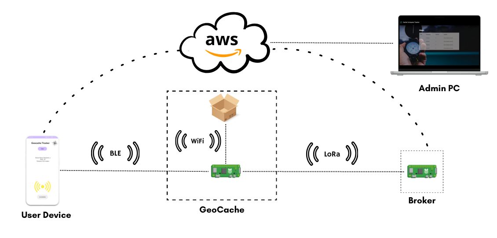
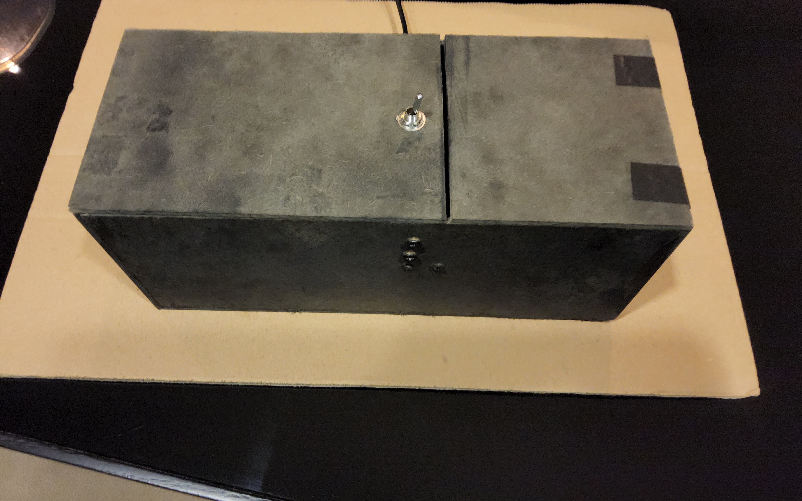
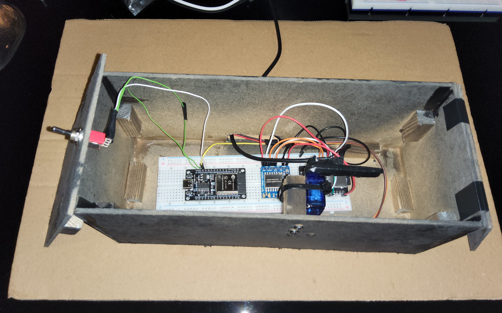

# Deployed Nodes

In this section we'll be approaching our systems deployed nodes, which are comprised of the GeoCache and a Broker. This nodes will be present in the field/real-world and will be used to connect with the companies network, to authorize or deny a user to access the GeoCache. The architecture of the system, including a basic role and the communication method can be observed in the following image:

---
## GeoCache

The GeoCache is the node that represents and interacts with the items and the compartment itself. It's responsible to:
* Be visible and be visible to be found and located by an user
* Exchange authorization information with the user and the Geocaching network, by intermediary of the Broker
* If the user was authorized, open the Box for him to interact and then close it

The final appearance of the GeoCache can be viewed in the following images:

|  |  |
| --------------- | --------------- |

<!--

    
    

-->

### Communication with User Device

As visible by the image, 

#### BLE

#### Message Types

### Communication with Broker

#### LoRa

#### Message Types

### Opening Box

### Communication with BoxOpener

#### WiFi

#### Messages

---
## Broker

### Communication with GeoCache

### Communication with AWS

#### WiFi

---
## Results and Analysis

---
## Future Work
