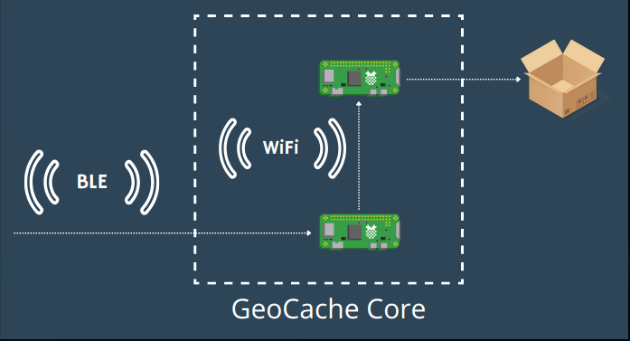

# Deployed Nodes

In this section we'll be approaching our systems deployed nodes, which are comprised of the GeoCache and a Broker. This nodes will be present in the field/real-world and will be used to connect with the companies network, to authorize or deny a user to access the GeoCache. The architecture of the system, including a basic role and the communication method can be observed in the following image:


---
# Development Environment
The systems developed in this sections are [ESP32-DEVKITC](https://www.digikey.pt/pt/products/detail/espressif-systems/ESP32-DEVKITC-32D/9356990?utm_adgroup=&utm_term=&productid=9356990&utm_content=&gad_source=1) and [ESP32CAM](https://www.ptrobotics.com/sensor-camera/7112-esp32-cam-wifi-and-bluetooth-module-w-camera-ov2640-2mp.html) micro-controllers. This devices are cheap, available and being based on the ESP32 **MCU**, offer WiFi and Bluetooth built-in. [^1]

The ESP32 can be programmed using the VSCode plugin [ESP-IDF](https://docs.espressif.com/projects/esp-idf/en/latest/esp32/get-started/index.html#introduction), which enables to program directly in the board native functions and registers, with no framework or translation layer.
However, in our case, we chose to develop using the [Arduino Framework](https://www.arduino.cc/) directly in VSCode, with the [PlatformIO](https://platformio.org/)  plugin. This approach allowed use to developed, flash and monitor code for the ESP32 all in one platform.

---
## GeoCache

The GeoCache is the node that represents and interacts with the items and the compartment itself. It's responsible to:
* Be visible and be visible to be found and located by an user
* Exchange authorization information with the user and the Geocaching network, by intermediary of the Broker
* If the user was authorized, open the Box for him to interact and then close it

As can be viewed in the image bellow, this node uses three communication technologies, BLE, WiFi and LoRa. Each of this technologies and their objectives will be developed in the following sections.



The final appearance of the GeoCache can be viewed in the following images:

|  |  |
| --------------- | --------------- |

<!--
<p float="left">
    
    
</p>-->

According to the **Arduino** Framework structure, the main file containing the code of the ESP32 has to have a `setup` and `loop` functions, which will configure the micro-controller and execute repeated tasks, respectively. This function is located in the [geocache folder](./geocache/src/main.cpp) and it's worth noting to point the configuration order of the services:
```c++
void setup() {
    // Initialize Serial Monitor
    Serial.begin(115200);
    while (!Serial)
        ;
    Serial.println("GeoCache Terminal ready");
    Serial.println();

    // Setup BLE Server
    bleServer.setup();

    // Setup wifi with box opener
    wifiClient.connect();

    // Setup LoRa868
    while (!lora.configure(VERBOSE))
        delay(3000);

    // Create LoRa Task to receive data
    //xTaskCreate(receive_lora, "receive_lora", 8000, NULL, 1, &loraTask);

    // Create BLE Task to receive data
    xTaskCreate(receive_ble, "receive_ble", 8000, NULL, 1, &bleTask);

    Serial.println();
}
```

### Communication with User Device

The GeoCache establishes communication with the User Device using BLE. It creates a BLE Server with the name **GeoCache_x** where `x` is the node id of the GeoCache.
The User Device can then scan for the GeoCaches with the configured name and upon connection can verify their authenticity by connection to the right `service.characteristic` **Universally Unique Identifier (UUID)**.

#### BLE

Following an object-oriented approach and a good development structure in C/C++, we kept separate files for the declarations and source code. The [header](./geocache/include/bleServer.h) is located at `./geocache/include/bleServer.h` and [src](./geocache/src/bleServer.cpp) at `./geocache/src/bleServer.cpp`.
Analyzing the `BleServer` class, we first have macros to define the maximum **MTU** for the ESP32, as well as for our **Service** and **Characteristic**:
```c++
//! Maximum Transmission Unit for BLE communication, it's 251 since esp32s
//   have Bluetooth 4.2
#define BLE_MTU 251
//! Unique identifier for the BLE service
#define SERVICE_UUID "4fafc201-1fb5-459e-8fcc-c5c9c331914b"
//! Unique identifier for the BLE characteristic
#define CHARACTERISTIC_UUID "beb5483e-36e1-4688-b7f5-ea07361b26a8"
```

Then we have the `callbacks` which are part of the `BleServer` class and used just to signal the server that can be used to trigger certain operations in the server, when a signal from the client is received. In this case we are only using it to signal that a client has connected/disconnected from the Server:
```c++
/*! \class MyBLEServerCallbacks
    \brief Callbacks for BLE server events.
*/
class MyBLEServerCallbacks : public BLEServerCallbacks {
    /*!< pointer to the parent BleClient object. */
    BleServer* parent;

    public:
    /*! \brief Constructor for MyBLEServerCallbacks.
        \param parent A pointer to the parent BleClient object.
    */
    MyBLEServerCallbacks(BleServer* parent) : parent(parent) {}

    /*! \brief Handles connection event.
        \param pServer Pointer to the BLE server.
    */
    void onConnect(BLEServer* pServer) { parent->connected = true; }

    /*! \brief Handles disconnection event.
        \param pServer Pointer to the BLE server.
    */
    void onDisconnect(BLEServer* pServer) {
        parent->connected = false;
        BLEDevice::startAdvertising();
    }
};
```

The configuration/setup of the BLE server starts by creating the Server with the defined name, creating the Service, setting up callbacks and then configuring the Characteristic. The remaining steps are just setting up a default value of the characteristic, start the service and then just configurations for better scanning:
```c++
void BleServer::setup() {
    String deviceName = "GeoCache_" + String(nodeId);
    BLEDevice::init(deviceName.c_str());
    pServer = BLEDevice::createServer();
    pService = pServer->createService(SERVICE_UUID);
    pServer->setCallbacks(new MyBLEServerCallbacks(this));
    pCharacteristic = pService->createCharacteristic(
        CHARACTERISTIC_UUID,
        BLECharacteristic::PROPERTY_READ | BLECharacteristic::PROPERTY_WRITE);
    //pCharacteristic->setMTU(512); // Set your desired MTU size here - only for BT 5.0 and above
    pCharacteristic->setValue("/");
    pService->start();
    BLEAdvertising* pAdvertising = BLEDevice::getAdvertising();
    pAdvertising->addServiceUUID(SERVICE_UUID);
    pAdvertising->setScanResponse(true);
    pAdvertising->setMinPreferred(
        0x06);  // functions that help with iPhone connections issue
    pAdvertising->setMinPreferred(0x12);
    BLEDevice::startAdvertising();
    
    Serial.println("BLE, Gateway visible to other ble devices!");
    Serial.println();
}
```

Some of the code used here as gathered from arduino example for BLE by Evandro Copercini and Neil Kolban [^2] and tutorial by MoThunderz [^3]

#### Message Types

Located in the `shared/message` folder is the **BleMessage** class, which creates and stores in the ESP32 *heap* a message. The [Header](./shared/message/include/message.h) and [Src](./shared/message/src/message.cpp) are located in the same folder.

Theres only two message types:
* **open_request**, to ask the GeoCache to open and has the following fields:
    * *Message Type*: 2 bytes
    * *Packet ID*: 4 bytes
    * *User ID*: 2 bytes
* **open_response**: GeoCache transmits the user, the authorization result (not used):
    * *Message Type*: 2 bytes
    * *Packet ID*: 4 bytes
    * *Authorized*: 1 byte

With the use of this classes, to send a message, only the following code would be needed:
```c++
size_t sendMsgSize;
uint8_t* msgToSend = bleMsgClass.open_request(
    sendMsgSize, bleClient.get_packet_count(), USER_ID);

bleClient.send(msgToSend, sendMsgSize);
```

#### Extras

To test the BLE server while the BLE app for Android was being developed, we created the [User Device](./userDevice/src/main.cpp) node, which would connect to the Server and periodically signal it to open the GeoCache. For this, we also developed a **BleClient** class with dedicated [Header](./userDevice/include/bleClient.h) and [Src](./userDevice/src/bleClient.cpp) files. We won't be discussing them here, since the scope of the project would be to work with the BLE app, which is also explained in another section.

### Communication with Broker

#### LoRa

#### Message Types

### Opening Box

### Communication with BoxOpener

#### WiFi

#### Messages

---
## Broker

### Communication with GeoCache

### Communication with AWS

#### WiFi

---
## Results and Analysis

---
## Future Work


---
# References

[^1]: ESP32 product page: https://www.espressif.com/en/products/socs/esp32
[^2]: BLE example: https://github.com/nkolban/esp32-snippets/blob/master/cpp_utils/tests/BLE%20Tests/SampleServer.cpp
[^3]: BLE tutorial: https://www.youtube.com/watch?v=0Yvd_k0hbVs&t=138s